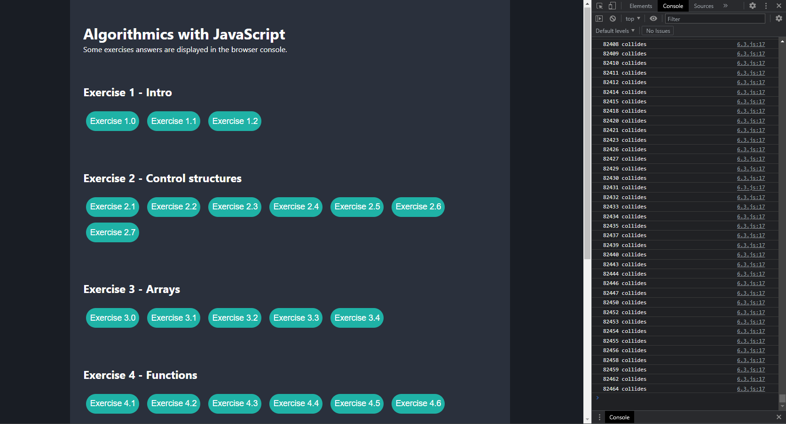

# Algorithmics with JavaScript
### Introductory exercises to algorithms with javascript

The solutions to the exercises are represented in the form of a web page. Just click a button to get the exercise answer. Some responses are displayed in the browser console, others as a pop-up window.

To access .js folder directly, [click here](https://github.com/manesjonathan/algo-js/tree/main/assets/js).

